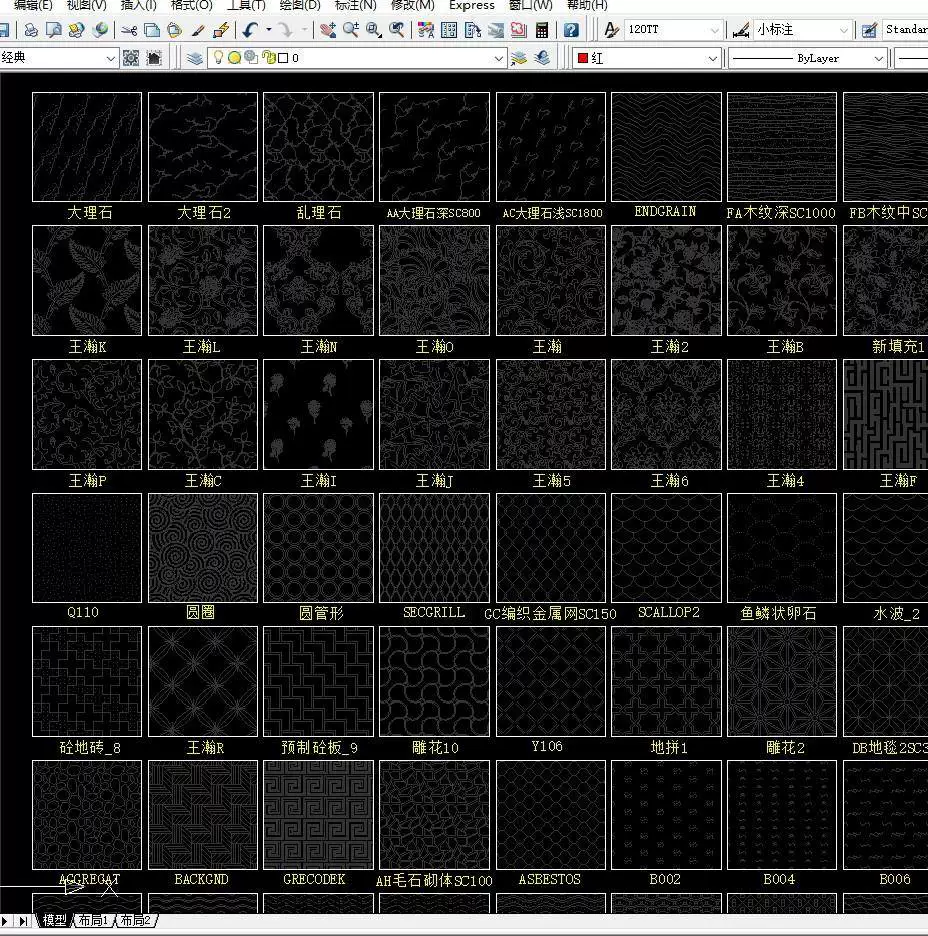
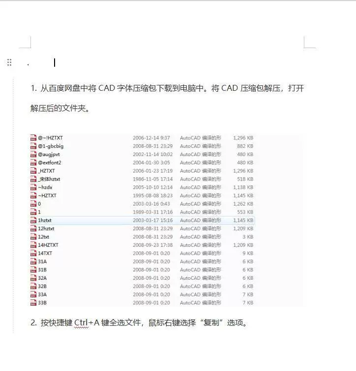

# CAD Font Library, Solution for Unreadable Symbols and Incomplete Pattern Filling in CAD Images

## Body

CAD font library comprehensive, solves garbled symbols display incompleteness, pattern fill background CAD drawing font.

CAD font library comprehensive, solves garbled symbols display incomplete and pattern fill background CAD drawing font.

CAD font library comprehensive, solves garbled symbols display incomplete, pattern fill background CAD drawing font problem question mark garbled and so on solves CAD2007-2020 75

Includes installation instructions and diagrams.

Automatic payment and shipping link

## Images

## Payment

Here is a pay link on Stripe ( https://buy.stripe.com/3cs8yP7sY87d0vu9AB ). Please contact me lonlonago@foxmail.com after funding $89, and I will send you a complete data files , thank you!

